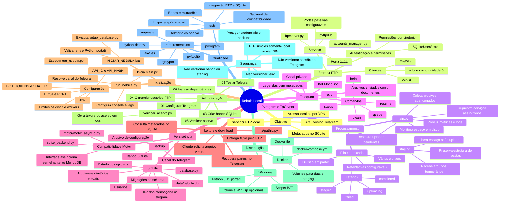
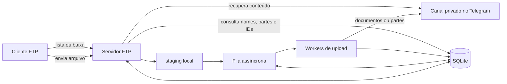

Exit code: 0
Wall time: 0.3 seconds
Output:
# Mapa mental do Nebula Local

Este mapa resume a arquitetura, os fluxos de dados, a operação e os principais arquivos do projeto.

## Fluxo principal

## Arquivos centrais

| Área | Arquivos | Responsabilidade |
|---|---|---|
| Aplicação | `main.py`, `run_nebula.py` | Inicialização, filas, workers, bot e tarefas de manutenção |
| FTP | `ftp/server.py`, `ftp/pathio.py`, `ftp/tg.py` | Protocolo FTP e acesso ao conteúdo virtual |
| Persistência | `database.py`, `sqlite_backend.py` | Schema, migrações e camada assíncrona sobre SQLite |
| Administração | `accounts_manager.py`, `configurar_telegram.py`, `verificar_acervo.py` | Usuários, credenciais do Telegram e auditoria do acervo |
| Operação | `*.bat`, `.env`, `requirements.txt` | Instalação, configuração e execução no Windows |
| Contêiner | `Dockerfile`, `docker-compose.yml` | Execução isolada e volumes persistentes |
| Testes | `tests/` | Verificação do banco, FTP, uploads e relatórios |

