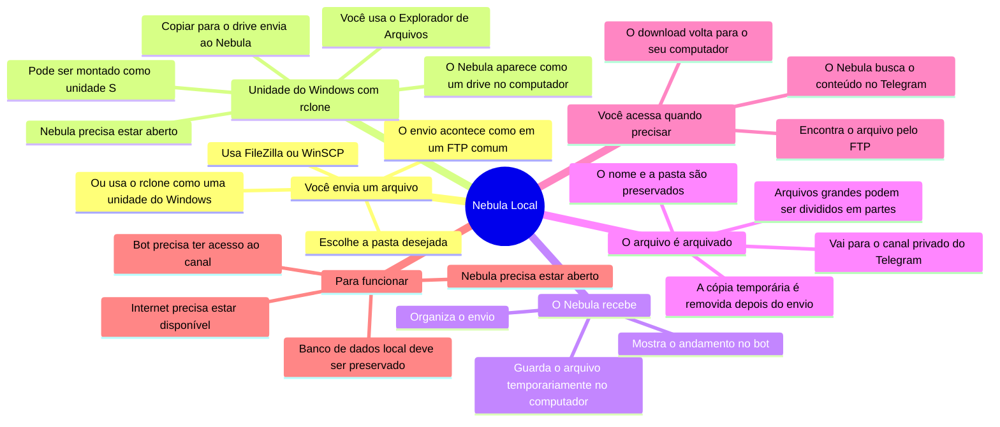
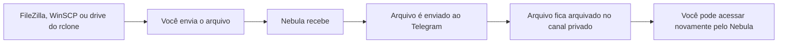

# Mapa mental do Nebula Local

O Nebula permite enviar arquivos pelo computador e guardá-los em um canal privado do Telegram.

## Caminho do arquivo

> **Em resumo:** o arquivo enviado ao Nebula é arquivado no canal privado do Telegram. O Nebula mantém as informações necessárias para localizar e recuperar esse arquivo depois.

## Usar como um drive com o rclone

O rclone pode apresentar o Nebula como uma unidade do Windows, por exemplo `S:` com o nome `FTPLOCAL`. Assim, você pode abrir o Explorador de Arquivos e copiar, mover ou abrir pastas como faria em outro drive.

Ao copiar um arquivo para essa unidade, o rclone entrega o arquivo ao Nebula. Em seguida, o Nebula o arquiva no canal privado do Telegram. Para acessar a unidade, o Nebula e a montagem do rclone precisam estar em execução.

Para configurar essa opção:

1. Instale o WinFsp usando o instalador incluído na pasta `rclone`.
2. Execute `rclone\01_Rclone config.bat` e configure o acesso chamado `FTPLOCAL`.
3. Inicie o Nebula com `INICIAR_NEBULA.bat`.
4. Execute `rclone\02_mount_FTPLOCAL.bat` para montar a unidade `S:`.

> O drive do rclone é uma forma mais familiar de acessar o Nebula. Os arquivos continuam sendo arquivados no Telegram; eles não ficam armazenados permanentemente na unidade `S:`.

## O que deve ser protegido

- O canal privado do Telegram, onde os arquivos ficam arquivados.
- O banco local `data/nebula.db`, que funciona como o catálogo dos arquivos.
- O arquivo `.env` e a sessão do bot, que contêm dados de acesso e não devem ser compartilhados.

