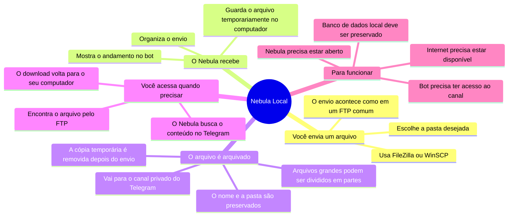
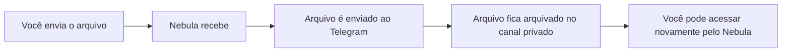

# Mapa mental do Nebula Local

O Nebula permite enviar arquivos pelo computador e guardá-los em um canal privado do Telegram.

## Caminho do arquivo

> **Em resumo:** o arquivo enviado ao Nebula é arquivado no canal privado do Telegram. O Nebula mantém as informações necessárias para localizar e recuperar esse arquivo depois.

## O que deve ser protegido

- O canal privado do Telegram, onde os arquivos ficam arquivados.
- O banco local `data/nebula.db`, que funciona como o catálogo dos arquivos.
- O arquivo `.env` e a sessão do bot, que contêm dados de acesso e não devem ser compartilhados.
